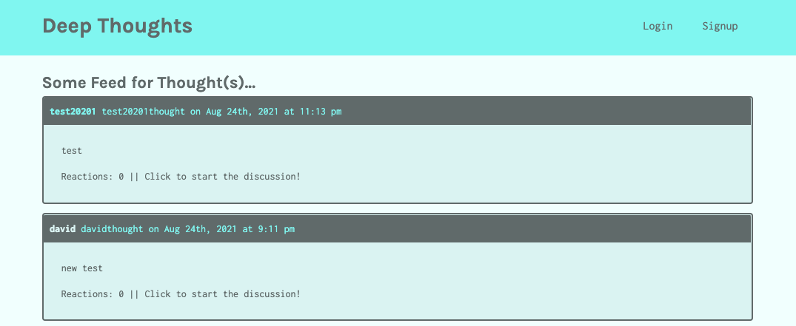

# deep-thoughts

MERN social media app using GraphQL. Users can create an account, add a thought, reply to a thought, and add friends.



|                                         |                                         |                                                   |
| :-------------------------------------: | :-------------------------------------: | :-----------------------------------------------: |
|     [Introduction](#deep-thoughts)      | [Table of Contents](#table-of-contents) | [Development Highlights](#development-highlights) |
|      [Installation](#installation)      |    [Page Directory](#page-directory)    |       [Code Hightlights](#code-highlights)        |
| [Technologies Used](#Technologies-Used) |           [Credits](#Credits)           |                [License](#License)                |

## Development Highlights

- Integrate the Apollo Server GraphQL library to handle data requests.

- Build query type definitions and resolvers for retrieving data from MongoDB database.

- Use GraphQL mutations to handle updates.

- Sign and verify JSON Web Tokens to authenticate.

- Use Apollo Client library to consume GraphQL APIs on the front end.

## Installation

1. Install node modules

```
npm i
```

2. Open MongoDB

```
mongodb
```

3. Start App

```
npm start
```

## Page Directory

### Client

Client contains react as the front end. The src is divided into components and pages. Pages are rendered using react-router-dom. The utils directory contains the Authentication and GraphQL mutations and queries.

### Server

The config contains the connection to Mongodb and deployment database. The models are used to define the models for Mongodb. The schemas are used to define the resolvers and typeDefs for GraphQL.

## Code Highlights

Class that obtains the authentication used.

```JavaScript
class AuthService {
    getProfile() {
        return decode(this.getToken());
    }
    loggedIn() {
        const token = this.getToken();
        return !!token && !this.isTokenExpired(token);
    }
    isTokenExpired(token) {
        try {
            const decoded = decode(token);
            if (decoded.exp < Date.now() / 1000) {
                return true;
            } else {
                return false;
            }
        } catch (err) {
            return false;
        }
    }
    getToken() {
        return localStorage.getItem('id_token')
    }
    login(idToken) {
        localStorage.setItem('id_token', idToken);
        window.location.assign('/')
    }
    logout() {
        localStorage.removeItem('id_token');
        window.location.assign('/');
    }
}

```

## Technologies

### Frontend

- [HTML](https://www.w3schools.com/html/)
- [JavaScript](https://www.javascript.com/)
- [CSS](https://www.w3schools.com/css/)

### Frontend Framework/Library

- [ReactJS](https://reactjs.org/)
- [ApolloClient](https://www.apollographql.com/docs/react/)

### Backend Language

- [Node.js](https://nodejs.org/en/)

### GraphQL

- [graphql](https://graphql.org/)
- [ApolloServer](https://www.apollographql.com/docs/apollo-server/)

### Database

- [MongoDB](https://www.mongodb.com/)

## Credits

|                           |                                                                                                                                                                                                       |
| ------------------------- | ----------------------------------------------------------------------------------------------------------------------------------------------------------------------------------------------------- |
| **David Anusontarangkul** | [ LinkedIn](https://www.linkedin.com/in/anusontarangkul/) [ GitHub](https://github.com/anusontarangkul) |

## License

[](https://opensource.org/licenses/MIT)
